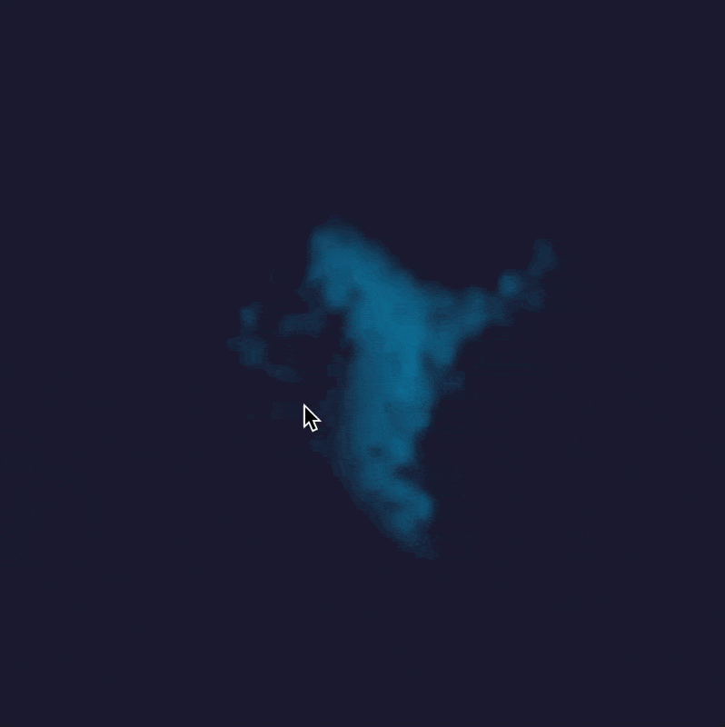

# Glasatar (glasatarjs)

A WebGL-based voice visualizer that creates realistic privacy glass effects, distorting and blurring background content with audio-reactive animations.



## Features

- 🔮 **Realistic Glass Textures**: Arctic (crystalline), Cathedral (flowing), Autumn (organic), and Flemish (hammered) patterns
- 🎤 **Audio-Reactive**: Glass distortion responds to voice amplitude and frequency
- 🌊 **Real-time Refraction**: Realistic light bending and distortion effects
- 📸 **Background Support**: Works with any background content (images, canvas drawings, etc.)
- ✨ **WebGL Performance**: Hardware-accelerated rendering with custom shaders
- 📦 **TypeScript Support**: Fully typed for excellent developer experience

## Installation

```bash
npm install @jimhill/glasatarjs
```

or

```bash
yarn add @jimhill/glasatarjs
```

### For Core Library Only (No React)

If you only need the core WebGL library without React dependencies:

```bash
npm install @jimhill/glasatarjs --no-optional
```

## Quick Start

### React Component

```tsx
import { Glasatar } from '@jimhill/glasatarjs';

function App() {
  const [audioStream, setAudioStream] = useState<MediaStream | null>(null);

  const startRecording = async () => {
    const stream = await navigator.mediaDevices.getUserMedia({ audio: true });
    setAudioStream(stream);
  };

  return (
    <Glasatar
      audioStream={audioStream}
      width={500}
      height={500}
      texture="reeded"
      glassOpacity={0.95}
      refractionStrength={20.0}
      blurAmount={15.0}
      avatarColor="#00c7fc"
      avatarSize={37}
      avatarSensitivity={1.8}
      avatarExpansion={49.4}
      avatarSmoothing={0.23}
      avatarFadeWithAudio={true}
      backgroundColor="#1a1a2e"
      backgroundType="linear-gradient"
      backgroundGradient={{
        centerColor: '#c4bc00',
        edgeColor: '#ff8647',
        angle: 343,
      }}
      backgroundRotation={true}
      backgroundRotationSpeed={10}
      backgroundScale={1.5}
    />
  );
}
```

### Vanilla JavaScript / Core Library

```javascript
import { GlastarJS } from '@jimhill/glasatarjs/core';
// Or if using the full package:
// import { GlastarJS } from '@jimhill/glasatarjs';

// Create canvas element
const canvas = document.getElementById('visualizer');

// Initialize renderer
const renderer = new GlastarJS(canvas, {
  width: 500,
  height: 500,
  texture: 'reeded',
  glassOpacity: 0.95,
  refractionStrength: 20.0,
  blurAmount: 15.0,
  avatarColor: '#00c7fc',
  avatarSize: 37,
  avatarSensitivity: 1.8,
  avatarExpansion: 49.4,
  avatarSmoothing: 0.23,
  avatarFadeWithAudio: true,
  backgroundColor: '#1a1a2e',
  backgroundType: 'linear-gradient',
  backgroundGradient: {
    centerColor: '#c4bc00',
    edgeColor: '#ff8647',
    angle: 343,
  },
  backgroundRotation: true,
  backgroundRotationSpeed: 10,
  backgroundScale: 1.5,
});

// Start rendering
renderer.start();

// Connect audio stream
navigator.mediaDevices.getUserMedia({ audio: true }).then(stream => {
  renderer.connectAudioStream(stream);
});

// Clean up when done
// renderer.dispose();
```

## API Reference

### Glasatar (React Component)

| Prop                 | Type                                               | Default    | Description                         |
| -------------------- | -------------------------------------------------- | ---------- | ----------------------------------- |
| `audioStream`        | `MediaStream \| null`                              | `null`     | Audio stream from getUserMedia      |
| `width`              | `number`                                           | `800`      | Canvas width in pixels              |
| `height`             | `number`                                           | `600`      | Canvas height in pixels             |
| `texture`            | `'arctic' \| 'cathedral' \| 'autumn' \| 'flemish'` | `'arctic'` | Glass texture pattern               |
| `glassOpacity`       | `number`                                           | `0.95`     | Glass opacity (0.85-1.0)            |
| `refractionStrength` | `number`                                           | `1.0`      | Light refraction intensity (0-2.0)  |
| `blurAmount`         | `number`                                           | `3.0`      | Background blur amount (0-10.0)     |
| `backgroundContent`  | `HTMLImageElement \| HTMLCanvasElement \| string`  | -          | Static background content           |
| `onBackgroundDraw`   | `(ctx, width, height) => void`                     | -          | Dynamic background drawing callback |
| `className`          | `string`                                           | -          | CSS class name                      |
| `style`              | `React.CSSProperties`                              | -          | Inline styles                       |

### GlastarJS (Core Library)

#### Constructor

```typescript
new GlastarJS(canvas: HTMLCanvasElement, config?: Partial<GlasatarConfig>)
```

#### Methods

- `start()`: Begin rendering animation
- `stop()`: Stop rendering animation
- `connectAudioStream(stream: MediaStream)`: Connect audio input
- `setBackgroundContent(content: HTMLImageElement | HTMLCanvasElement | string)`: Set static background
- `updateBackgroundContent(callback: (ctx, width, height) => void)`: Update dynamic background
- `updateConfig(config: Partial<GlasatarConfig>)`: Update configuration
- `resize(width: number, height: number)`: Resize canvas
- `dispose()`: Clean up resources

#### Configuration Options

All configuration options from the React component props are also available in the `GlasatarConfig` object for the core library.

## Glass Textures

### Arctic

Fine crystalline pattern with sharp, ice-like distortions. Creates a frosted glass effect with small-scale detail.

### Cathedral

Large, flowing organic patterns that create smooth, wave-like distortions. Similar to traditional cathedral glass.

### Autumn

Organic, leaf-like structures with natural flowing patterns. Creates a more random, nature-inspired distortion.

### Flemish

Hammered glass effect with regular dimpled patterns. Creates a classic obscure glass look with circular distortions.

## Development

### Setup

```bash
# Install dependencies
npm install

# Run demo app
npm run dev

# Build library
npm run build:lib

# Build everything
npm run build
```

### Project Structure

```
glasatar/
├── src/
│   ├── lib/              # Core TypeScript library
│   │   ├── privacy-glass-renderer.ts
│   │   ├── audio-analyzer.ts
│   │   ├── shaders.ts
│   │   └── types.ts
│   └── components/       # React components
│       └── Glasatar.tsx
├── demo/                 # Demo application
│   └── src/
│       ├── App.tsx
│       └── main.tsx
└── dist/                 # Built library files
```

## Browser Support

- Chrome/Edge 80+
- Firefox 75+
- Safari 13.1+
- Requires WebGL support and microphone permissions

## License

MIT

## Framework Integration

### Vue.js Example

```javascript
import { GlastarJS } from '@jimhill/glasatarjs/core';

export default {
  mounted() {
    this.renderer = new GlastarJS(this.$refs.canvas, {
      texture: 'arctic',
      // ... other config
    });
    this.renderer.start();
  },

  beforeUnmount() {
    this.renderer?.dispose();
  },

  template: '<canvas ref="canvas"></canvas>',
};
```

### Angular Example

```typescript
import {
  Component,
  ViewChild,
  ElementRef,
  OnInit,
  OnDestroy,
} from '@angular/core';
import { GlastarJS } from '@jimhill/glasatarjs/core';

@Component({
  selector: 'app-glasatar',
  template: '<canvas #canvas></canvas>',
})
export class GlasatarComponent implements OnInit, OnDestroy {
  @ViewChild('canvas', { static: true })
  canvasRef!: ElementRef<HTMLCanvasElement>;
  private renderer?: GlastarJS;

  ngOnInit() {
    this.renderer = new GlastarJS(this.canvasRef.nativeElement, {
      texture: 'arctic',
      // ... other config
    });
    this.renderer.start();
  }

  ngOnDestroy() {
    this.renderer?.dispose();
  }
}
```

### Svelte Example

```svelte
<script>
  import { onMount, onDestroy } from 'svelte';
  import { GlastarJS } from '@jimhill/glasatarjs/core';

  let canvas;
  let renderer;

  onMount(() => {
    renderer = new GlastarJS(canvas, {
      texture: 'arctic',
      // ... other config
    });
    renderer.start();
  });

  onDestroy(() => {
    renderer?.dispose();
  });
</script>

<canvas bind:this={canvas}></canvas>
```

## Testing

### Testing Built Files Locally

Before publishing to npm, you can test the built library files locally to ensure everything works correctly:

```bash
# Build library and run demo with built files
npm run test:built-files
```

This command:

1. Builds the library files to the `dist` directory
2. Starts a local dev server on port 5174 that uses the built files instead of source files
3. Allows you to test exactly what will be published to npm

This is particularly useful for catching bundling issues that might not appear when running the regular development server.

## Contributing

Contributions are welcome! Please feel free to submit a Pull Request.

1. Fork the repository
2. Create your feature branch (`git checkout -b feature/amazing-feature`)
3. Commit your changes (`git commit -m 'Add some amazing feature'`)
4. Push to the branch (`git push origin feature/amazing-feature`)
5. Open a Pull Request

## Acknowledgments

- Inspired by real-world obscure glass textures and patterns
- WebGL shader techniques for realistic glass simulation
- Audio visualization using Web Audio API
